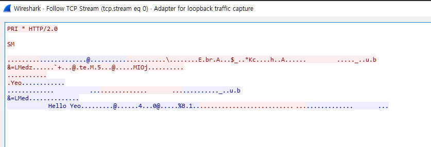

# Go gRPC Example

## 프로젝트 목표
- gRPC 를 사용해보고 이해하기
- 해당 프로젝트는 [go-grpc 튜토리얼](https://grpc.io/docs/languages/go/quickstart/)을 참고하여 작성함 

## gRPC
- 원격지 프로시저를 수행하는 규칙 및 파라미터 전달을 위한 인터페이스로 [protocol buffer](https://github.com/protocolbuffers/protobuf-go) 라는 오픈 소스를 활용하고 있음
- Blocking & Non-Blocking 지원
- HTTP/2 프로토콜 사용
- 인증, 로드밸런싱, 트레이싱, 헬스체크 등을 제공
- 10개 언어에서 지원되는 라이브러리가 있음
- protocol buffer를 사용하는 이점 중 하나는 .proto 파일로 구조화된 데이터를 작성하기만 한다면 gRPC가 지원하는 어떤 언어에서는 규약에 상관없이 통신이 가능하다는 점이다.
- 작성된 .proto 로부터 언어에 맞는 stub을 생산하여 참조하게 되면 이후 별도의 사양서를 볼 필요없이 참조한 stub 만으로도 개발이 가능하다.

## Rest API 대비 강점
- gRPC 는 HTTP/2 레이어 위에서 Protocol Buffers를 사용해 직렬화된 바이트 스트림으로 통신하므로 JSON 기반의 통신보다 더 가볍고 통신 속도가 빠르다.
- Rest API의 경우 명세가 바뀌면 문서를 수정해서 전달해야 하는데, 소스코드에는 변경이 되었으나, 문서에 반영하지 않는 등의 문제가 발생할 수 있다. 하지만 gRPC 사용 시 .proto 파일을 공유함으로서 source of truth를 만들 수 있다. 

## 구조
- helloworld : .proto 파일와 generate된 pb파일
- server : gRPC 서버
- client : gRPC 클라이언트
- name 데이터를 요청하면 'hello {name}' 을 응답하는 간단한 gRPC 서버

## 패킷 확인
- wireshark를 통해 gRPC 통신 패킷을 확인

- wireshark에서 Analyze - Decode As.. 설정에서 사용하는 TCP Port를 HTTP2 로 설정해줘야 위와 같이 확인이 가능하다. 안하면 그냥 TCP로 보인다.

- 요청 패킷(Yeo 라는 데이터를 보냄)

- 응답 패킷(Hello Yeo 응답)